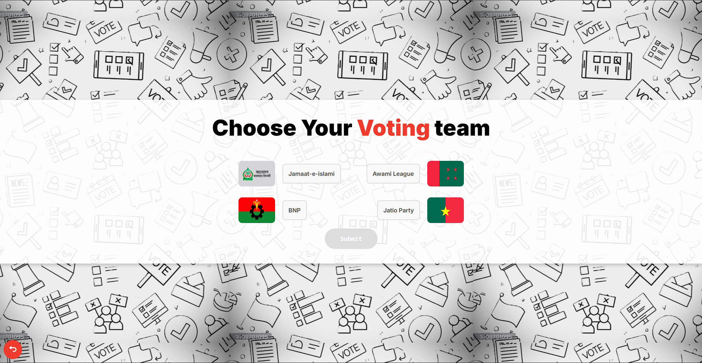

# 🗳️ Secure Voting Application

This is a **secure online voting system** built with **RAW PHP**.  
The primary focus is **security** — preventing unauthorized access, fraudulent voting, and abuse.


## Tech Stack
- PHP
- HTML5
- CSS3
- JavaScript
- PostgreSQL
- Encryption


## Security Features

### 1. Client-Side IP Verification
- Each request is tied to the client’s **IP address**.
- IPs are stored using PostgreSQL’s `INET` datatype.
- Suspicious requests are logged for auditing.

---

### 2. Authentication Attempt Control
- Every failed login increases a counter in the `invalid_attempts` table.
- If attempts exceed the safe threshold, the IP is **blocked**.
- This protects against brute-force and credential-stuffing attacks.

---

### 3. Blocked IPs
- Malicious IPs are stored in the `blocked_ips` table.
- Once blocked, all requests from that IP are automatically denied.

---

### 4. SQL Injection Prevention
- Queries use **PDO prepared statements** with placeholders.
- No user input is concatenated directly into SQL.
- Example:
  ```php
  $stmt = $pdo->prepare("SELECT * FROM users WHERE national_id = ?");
  $stmt->execute([$nid]);
- This prevents SQL injection completely.

---

### 5. Real-Time National ID Verification
- Every voter’s National ID (NID) is validated in real-time against the database.
- Prevents fake IDs, duplicate accounts, and multiple votes.

---

### 6. Encryption & Data Security
- Passwords and sensitive data are stored using bcrypt/argon2 hashing.
- All sessions and communications should run over HTTPS.
- Sensitive tokens are securely managed and never stored in plain text.

---

### 7. Safe Error Handling
- No raw database/system errors are exposed to users.
- All exceptions are caught and logged securely.


## Future Enhancements

- Multi-Factor Authentication (MFA)
- Rate limiting per endpoint
- Admin alerts on suspicious activity
- End-to-end encryption of voting process


## Screen Shot


